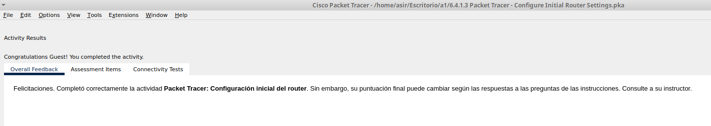

# Packet Tracer: Configuración inicial del router

## Objetivos


Parte 1: Verificar la configuración predeterminada del router

Parte 2: Configurar y verificar la configuración inicial del router

Parte 3: Guardar el archivo de configuración en ejecución

## Aspectos básicos


En esta actividad, configurará los parámetros básicos del router. Proporcionará un acceso seguro a la CLI y al puerto de consola mediante contraseñas cifradas y contraseñas de texto no cifrado. También configurará los mensajes para los usuarios que inicien sesión en el router. Estos avisos también advierten a los usuarios no autorizados que el acceso está prohibido. Por último, verificará y guardará la configuración en ejecución.

## Parte 1: Verificar la configuración predeterminada del router

#### Paso 1: Establecer una conexión de consola con el R


a. Elija un cable de consola de las conexiones disponibles.

b. Haga clic en `PCA` y seleccione `RS 232`.

c. Haga clic en `R1` y seleccione Console (Consola).

d. Haga clic en `PCA` -> ficha Desktop (Escritorio) > Terminal.

e. Haga clic en OK (Aceptar) y presione ENTER (INTRO). Ahora puede configurar R.

#### Paso 2: Ingresar al modo con privilegios y examinar la configuración actual.


Puede acceder a todos los comandos del router en el modo EXEC privilegiado. Sin embargo, debido a que muchos de los comandos privilegiados configuran parámetros operativos, el acceso privilegiado se debe proteger con contraseña para evitar el uso no autorizado.

a. Ingrese al modo EXEC con privilegios ingresando el comando enable.

```
Router> enable
Router#
```

Observe que la petición de entrada cambia en la configuración para reflejar el modo EXEC con privilegios.

b. Ingrese el comando show running-config :
```
Router# show running-config
```
c. Responda las siguientes preguntas:

¿Cuál es el nombre de host del router?

```
Router
```
¿Cuántas interfaces Fast Ethernet tiene el router?

```
4
```
¿Cuántas interfaces Gigabit Ethernet tiene el router?

```
2
```
¿Cuántas interfaces seriales tiene el router?

```
2
```
¿Cuál es el rango de valores que se muestra para las líneas vty?

```
0 4
```
d. Muestre el contenido actual de la NVRAM.

```
Router# show startup-config
startup-config is not present
```

¿Por qué el router responde con el mensaje startup-config is not present?

```
Porque todavia no esta configurado
```
## Parte 2: Configurar y verificar la configuración inicial del router


Para configurar los parámetros de un router, quizá deba pasar por diversos modos de configuración. Observe cómo cambia la petición de entrada mientras navega por el router.

#### Paso 1: Configurar los parámetros iniciales del R1.


Nota: si tiene dificultad para recordar los comandos, consulte el contenido de este tema. Los comandos son los mismos que configuró en un switch.


a. Establezca R1 como nombre del host.
```
Router#configure terminal 
Enter configuration commands, one per line.  End with CNTL/Z.
Router(config)#hostname R1
R1(config)#
```
b. Utilice las siguientes contraseñas:

1) Consola: letmein

2) EXEC con privilegios, sin cifrar: cisco

3) EXEC con privilegios, cifrado: itsasecret

```
    1.R1(config)#line console 0
      R1(config-line)#password letmein
    2.R1(config)#enable password cisco
    3.R1(config)#enable secret itsasecret
```

c. Cifre todas las contraseñas de texto no cifrado.

```
R1(config)#service password-encryption
```

d. Texto del mensaje del día: Unauthorized access is strictly prohibited (El acceso no autorizado queda
terminantemente prohibido).

```
R1(config)#banner motd #
Enter TEXT message.  End with the character '#'.
Unauthorized access is stricly#
```
#### Paso 2: Verificar los parámetros iniciales del R1.


a. Para verificar los parámetros iniciales, observe la configuración de R1. ¿Qué comando utiliza?

```
R1#show running-config
```

b. Salga de la sesión de consola actual hasta que vea el siguiente mensaje:
```
R1 con0 is now available
Press RETURN to get started.
```

c. Presione ENTER (INTRO); debería ver el siguiente mensaje:
```
Unauthorized access is strictly prohibited.
User Access Verification
Password:
```

¿Por qué todos los routers deben tener un mensaje del día (MOTD)?

```
Cada router debe tener un banner para advertir a los usuarios no autorizados que el acceso está prohibido.
```
Si no se le pide una contraseña, ¿qué comando de la línea de consola se olvidó de configurar?

```
R1(config-line)# login
```
d. Escriba las contraseñas necesarias para volver al modo EXEC con privilegios.

¿Por qué la contraseña de enable secret permitiría el acceso al modo EXEC privilegiado y la contraseña de enable dejaría de ser válida?

```
La contraseña de enable secret sobrescribe la contraseña de enable.
```
Si configura más contraseñas en el router, ¿se muestran como texto no cifrado o en forma cifrada en el archivo de configuración? Explique.

```
El comando service password-encryption encriptará todas las contraseñas actuales y futuras.
```

## Parte 3: Guardar el archivo de configuración en ejecución

#### Paso 1: Guardar el archivo de configuración en la NVRAM.

a. Acaba de configurar los parámetros iniciales de R1. Ahora haga una copia de respaldo del archivo de configuración en ejecución en la NVRAM para garantizar que no se pierdan los cambios realizados si el sistema se reinicia o se apaga.

```
R1#copy running-config startup-config 
Destination filename [startup-config]? 
Building configuration...
[OK]
```
¿Qué comando introdujo para guardar la configuración en la NVRAM?

```
copy running-config startup-config
```
¿Cuál es la versión más corta e inequívoca de este comando?

```
cop r st
```
¿Qué comando muestra el contenido de la NVRAM?

```
show startup-configuration o show start
```
b. Verifique que se registren todos los parámetros configurados. Si no fuera así, analice el resultado y determine qué comandos no se introdujeron o se introdujeron incorrectamente. También puede hacer clic en Check Results (Verificar resultados) en la
ventana de instrucción.


#### Paso 2: Puntos extra opcional: guarde el archivo de configuración de inicio en la memoria flash.


Aunque aprenderá más sobre la administración del almacenamiento flash de un router en los siguientes capítulos, le puede interesar saber ahora que puede guardar el archivo de configuración de inicio en la memoria flash como procedimiento de respaldo adicional. De manera predeterminada, el router seguirá cargando la configuración de inicio desde la NVRAM, pero si esta se daña, puede restablecer la configuración de inicio copiándola de la memoria flash.

Complete los siguientes pasos para guardar la configuración de inicio en la memoria flash.

a. Examine el contenido de la memoria flash con el comando `show flash` :

```
```
¿Cuántos archivos hay almacenados actualmente en la memoria flash?

```

```
¿Cuál de estos archivos cree que es la imagen de IOS?

```

```
¿Por qué cree que este archivo es la imagen de IOS?

```

```
b. Guarde el archivo de configuración de inicio en la memoria flash con los siguientes comandos:
```
copy startup-config flash
Destination filename [startup-config]
```

El router le pide que guarde el archivo en la memoria flash con el nombre entre corchetes. Si la respuesta es afirmativa, presione Entrar ; de lo contrario, escriba un nombre adecuado y presione la tecla Entrar.

c. Utilice el comando `show flash` para verificar que el archivo de configuración de inicio ahora esté almacenado en la memoria flash.

``` 

```