1. El puente raiz es el sw03
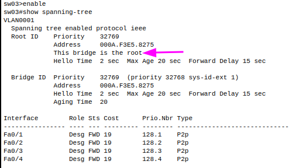

2. Identificar los puertos no designados y en que switch se encuentran.

en el sw02:
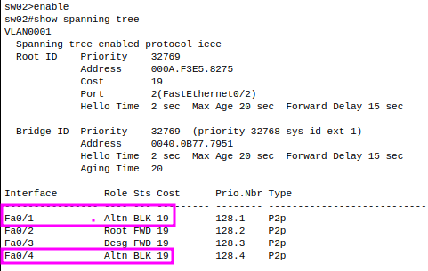

en el sw04:
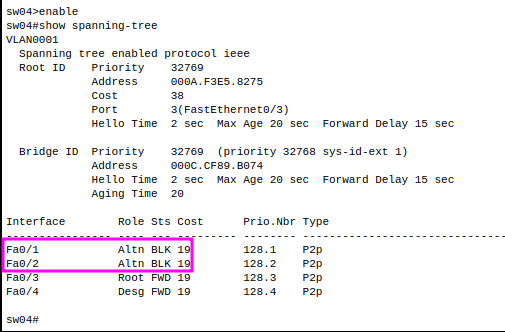

3. Comprobar que ya no existen bucles en nuestra red.

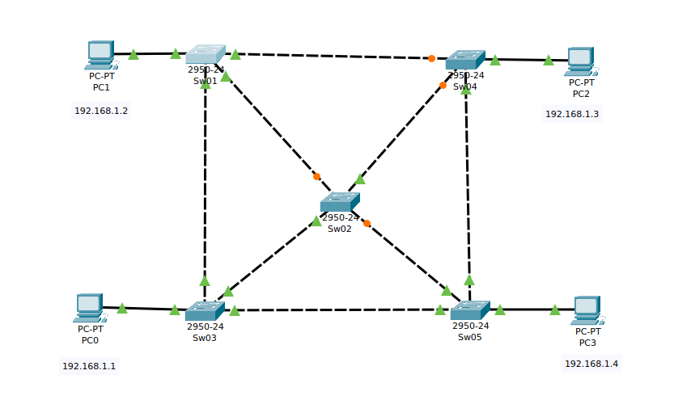
como se ve en la imagen el protocolo STP ha configurado los puertos de forma logica

4. Comprobar que existe un camino único entre cada par de switches.

    +Entre sw01 y sw02:
    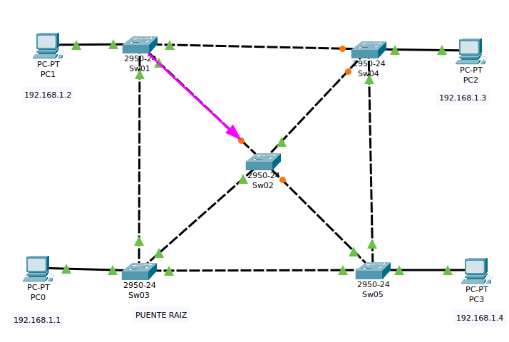
    +Entre sw01 y sw03:
    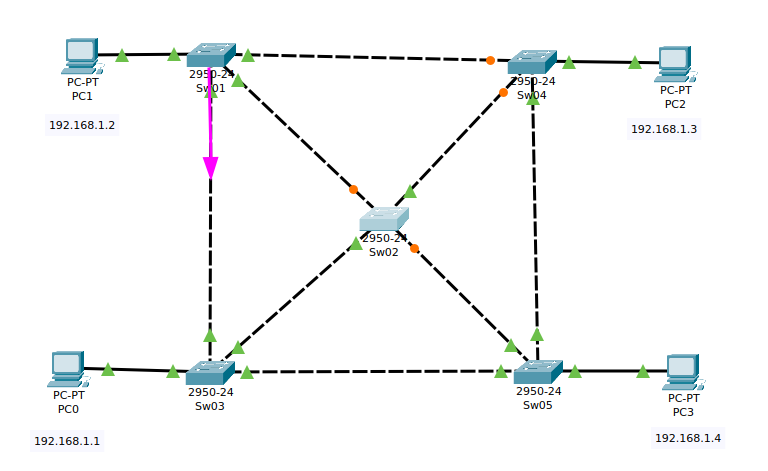
    +Entre sw01 y sw04:
    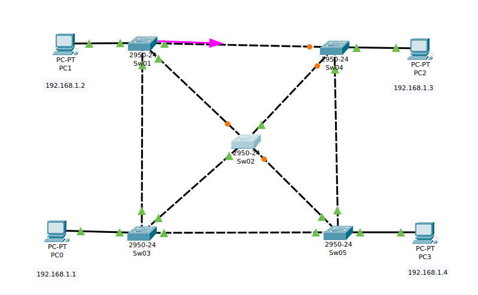
    +Entre sw01 y sw05:
    

5. Hacer pruebas de conectividad entre todos los equipos de la red.

PC0:

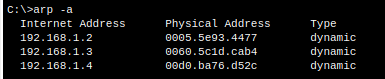

PC01

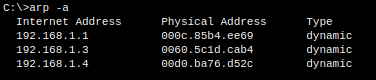

PC02

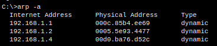

PC03

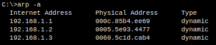

