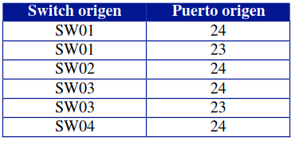

## EJERCICIO 1

1. diseño de topologia


2. Insertar una nueva VLAN, que será la VLAN número 2, con el nombre
PRUEBAV2.

Para mostrar las vlan configuradas en el switch ejecutamos:

~~~
gerard_sw#show vlan brief

VLAN Name                             Status    Ports
---- -------------------------------- --------- -------------------------------
1    default                          active    Fa0/1, Fa0/2, Fa0/3, Fa0/4
                                                Fa0/5, Fa0/6, Fa0/7, Fa0/8
                                                Fa0/9, Fa0/10, Fa0/11, Fa0/12
                                                Fa0/13, Fa0/14, Fa0/15, Fa0/16
                                                Fa0/17, Fa0/18, Fa0/19, Fa0/20
                                                Fa0/21, Fa0/22, Fa0/23, Fa0/24
                                                Gig0/1, Gig0/2
1002 fddi-default                     active    
1003 token-ring-default               active    
1004 fddinet-default                  active    
1005 trnet-default                    active     
~~~

Para insertar una nueva vlan ejecutamos:

~~~
gerard_sw#conf term
Enter configuration commands, one per line.  End with CNTL/Z.
gerard_sw(config)#vlan 2
gerard_sw(config-vlan)#name PRUEVAV2
gerard_sw(config-vlan)#
~~~

Comprobamos que se ha creado correctamente la nueva vlan

~~~
gerard_sw#show vlan brief

VLAN Name                             Status    Ports
---- -------------------------------- --------- -------------------------------
1    default                          active    Fa0/1, Fa0/2, Fa0/3, Fa0/4
                                                Fa0/5, Fa0/6, Fa0/7, Fa0/8
                                                Fa0/9, Fa0/10, Fa0/11, Fa0/12
                                                Fa0/13, Fa0/14, Fa0/15, Fa0/16
                                                Fa0/17, Fa0/18, Fa0/19, Fa0/20
                                                Fa0/21, Fa0/22, Fa0/23, Fa0/24
                                                Gig0/1, Gig0/2
2    PRUEVAV2                         active    
1002 fddi-default                     active    
1003 token-ring-default               active    
1004 fddinet-default                  active    
1005 trnet-default                    active
~~~

4.Realizar la siguiente configuración de redes VLAN:


Para ello ejecutamos:

~~~
gerard_sw#configure ter
gerard_sw#configure terminal 
Enter configuration commands, one per line.  End with CNTL/Z.
gerard_sw(config)#interface fastEthernet 0/2
gerard_sw(config-if)#switchport access vlan 2
gerard_sw(config-if)#exit
gerard_sw(config)#interface fastEthernet 0/4
gerard_sw(config-if)#switchport access vlan 2
~~~


Vamos a comprobar que los puertos se han asignado correctamente a cada vlan:

~~~
gerard_sw#show vlan brief

VLAN Name                             Status    Ports
---- -------------------------------- --------- -------------------------------
1    default                          active    Fa0/1, Fa0/3, Fa0/5, Fa0/6
                                                Fa0/7, Fa0/8, Fa0/9, Fa0/10
                                                Fa0/11, Fa0/12, Fa0/13, Fa0/14
                                                Fa0/15, Fa0/16, Fa0/17, Fa0/18
                                                Fa0/19, Fa0/20, Fa0/21, Fa0/22
                                                Fa0/23, Fa0/24, Gig0/1, Gig0/2
2    PRUEVAV2                         active    Fa0/2, Fa0/4
1002 fddi-default                     active    
1003 token-ring-default               active    
1004 fddinet-default                  active    
1005 trnet-default                    active    
~~~

5. Realizar ping entre los diferentes equipos para comprobar que la configuración
anterior funciona correctamente:


## EJERCICIO 2

1. Montamos la topologia de red:


3. Insertar una nueva VLAN, que será la VLAN número 2, con el nombre
PRUEBAV2; VLAN número 3, con el nombre PRUEBAV3:

eJECUTAMOS EN CADA SWITCH ESTOS COMANDOS COMANDOS:

~~~
gerard_SW01(config)#vlan 2
gerard_SW01(config-vlan)#name PRUEBAV2
gerard_SW01(config-vlan)#exit
gerard_SW01(config)#vlan 3
gerard_SW01(config-vlan)#name PRUEBAV3
~~~

Comprobamos que se ha creado correctamente:

~~~
gerard_SW01#show vlan brief

VLAN Name                             Status    Ports
---- -------------------------------- --------- -------------------------------
1    default                          active    Fa0/1, Fa0/2, Fa0/3, Fa0/4
                                                Fa0/5, Fa0/6, Fa0/7, Fa0/8
                                                Fa0/9, Fa0/10, Fa0/11, Fa0/12
                                                Fa0/13, Fa0/14, Fa0/15, Fa0/16
                                                Fa0/17, Fa0/18, Fa0/19, Fa0/20
                                                Fa0/21, Fa0/22, Fa0/23, Fa0/24
                                                Gig0/1, Gig0/2
2    PRUEBAV2                         active    
3    PRUEBAV3                         active    
1002 fddi-default                     active    
1003 token-ring-default               active    
1004 fddinet-default                  active    
1005 trnet-default                    active 
~~~


4. Realizar la siguiente configuración de redes VLAN:


Ejecutamos el codigo en cada switch siguiente solo en aquellas maquinas que se conenecten a las VLAN2 y VLAN3.
~~~
gerard_SW01#conf term
Enter configuration commands, one per line.  End with CNTL/Z.
gerard_SW01(config)#interface FastEthernet 0/3
gerard_SW01(config-if)#switch
gerard_SW01(config-if)#switchport access vlan 3
~~~

Ahora que hemos configurado las vlan; vamos a guardar la configuracion del switch, de modo que si lo reiniciamos la cague, para ello ejecutamos en cada switch:

~~~
gerard_SW01>enable
gerard_SW01#copy running-config startup-config 
Destination filename [startup-config]? 
Building configuration...
[OK]
~~~

5. Realizar ping entre los diferentes equipos para comprobar que la configuración
de cada equipo funciona correctamente.


6. Unir los switchs de comunicaciones entre ellos siguiendo el siguiente esquema
de conexiones:


Comprobar que las comunicaciones entre los switchs funcionan correctamente. ¿Es esto
cierto? ¿Para qué VLAN funciona correctamente?

Para la vlan 1 vemos que hay comunicacion, esto se debe a que es la vlan por defecto:


Comprobamos que para la vlan 2 no funciona porque no hay enlace TRUNK entre los witchs:


7. Colocar la siguiente configuración de puertos TRUNK de VLAN.




Para configurar un puerto como trunk en un switch en Packet Tracer mediante la CLI, puedes usar los siguientes comandos:

+ Entra en modo de configuración global:


```
switch# configure terminal
```

+ Configura el modo de puerto para el puerto específico que deseas usar como trunk:


```
switch(config)# interface interface_number
```

+ Configura el modo de puerto para trunk:


```
switch(config-if)# switchport mode trunk
```

+ Configura los protocolos de VLAN permitidos en el trunk (opcional):


```
switch(config-if)# switchport trunk allowed vlan vlan_list
```

+ Verifica la configuración:


```
switch(config-if)# end
switch# show interfaces interface_number switchport
```

Nota: Reemplaza "interface\_number" y "vlan\_list" con los valores apropiados para tu entorno.

2 / 2

~~~
gerard_SW01>enable
gerard_SW01#conf term
Enter configuration commands, one per line.  End with CNTL/Z.
gerard_SW01(config)#interface fastEthernet 0/24
gerard_SW01(config-if)#switchport mode trunk

gerard_SW01(config-if)#
%LINEPROTO-5-UPDOWN: Line protocol on Interface FastEthernet0/24, changed state to down

%LINEPROTO-5-UPDOWN: Line protocol on Interface FastEthernet0/24, changed state to up

gerard_SW01(config-if)#switchport trunk allowed vlan 1,2
gerard_SW01(config-if)#end
gerard_SW01#
%SYS-5-CONFIG_I: Configured from console by console

gerard_SW01#copy running-config startup-config 
Destination filename [startup-config]? 
Building configuration...
[OK]
~~~

comprobamos que hace ping de una maquina de un switch a otra maquina de otro switch


