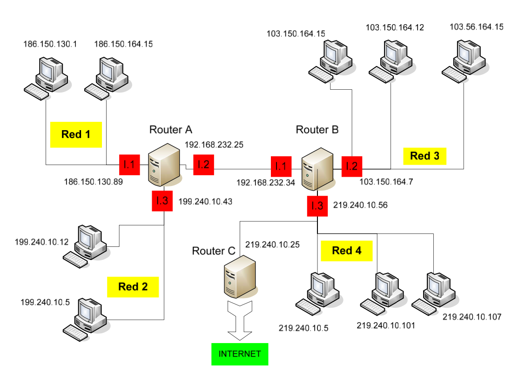
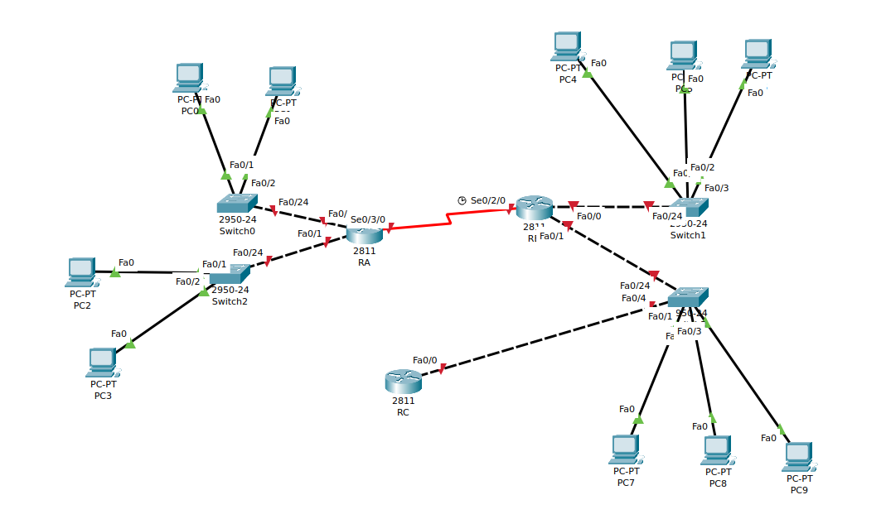

# EJERCICIO DE TABLAS DE ENCAMINAMIENTO

Dado el siguiente esquema:



1. Rellena las tablas de encaminamiento del `Router A`, `Router B` y `Router C` (usa las tablas que te suministra el profesor):

+ Router A
 
```
| DIRECCION DE RED | MASCARA       | ENCAMINADOR    | INTERFAZ | METRICA |
|------------------|---------------|----------------|----------|---------|
| 186.150.0.0      | 255.255.0.0   | 0.0.0.0        | L1       | 0       |
| 199.240.10.0     | 255.255.255.0 | 0.0.0.0        | L3       | 0       |
| 192.168.232.0    | 255.255.255.0 | 0.0.0.0        | L2       | 0       |
| 103.0.0.0        | 255.0.0.0     | 192.168.232.34 | L2       | 1       |
| 219.240.10.0     | 255.255.255.0 | 192.168.232.34 | L2       | 1       |
| 0.0.0.0          | 0.0.0.0       | 192.168.232.34 | L2       | 1       |
```


+ Router B

```
| DIRECCION DE RED | MASCARA       | ENCAMINADOR    | INTERFAZ | METRICA |
|------------------|---------------|----------------|----------|---------|
| 103.0.0.0        | 255.0.0.0     | 0.0.0.0        | L2       | 0       |
| 219.240.10.0     | 255.255.255.0 | 0.0.0.0        | L3       | 0       |
| 192.168.232.0    | 255.255.255.0 | 0.0.0.0        | L1       | 0       |
| 186.150.0.0      | 255.255.0.0   | 192.168.232.25 | L1       | 1       |
| 199.240.10.0     | 255.255.255.0 | 192.168.232.25 | L1       | 1       |
| 0.0.0.0          | 0.0.0.0       | 192.168.232.25 | L1       | 1       |
```

+ Router C

```
| DIRECCION DE RED | MASCARA       | ENCAMINADOR   | INTERFAZ | METRICA |
|------------------|---------------|---------------|----------|---------|
| 219.240.10.0     | 255.255.255.0 | 0.0.0.0       | L1       | 0       |
| 103.0.0.0        | 255.0.0.0     | 219.240.10.56 | L1       | 1       |
| 192.168.232.0    | 255.255.255.0 | 219.240.10.56 | L1       | 1       |
| 186.150.0.0      | 255.255.0.0   | 219.240.10.56 | L1       | 2       |
| 199.240.10.0     | 255.255.255.0 | 219.240.10.56 | L1       | 2       |
| 0.0.0.0          | 0.0.0.0       | 219.240.10.56 | L1       | 1       |
```

2. Realiza en Packet Tracer el diagrama de red tal y como el que se adjunta. Debes poner las direcciones ip que se indican así como los carteles. Configura en cada `PC` los parámetros de la red que le corresponden. Pon una imagen del resultado de tu montaje.




3. Establece el nombre de cada uno de los routers:

+ Router A

```
Router>enable
Router#conf term
Enter configuration commands, one per line.  End with CNTL/Z.
Router(config)#hostname RouterA
RouterA(config)
```

+ Router B

```
Router>enable
Router#conf term
Enter configuration commands, one per line.  End with CNTL/Z.
Router(config)#hostname RouterB
RouterB(config)
```

+ Router C

```
Router>enable
Router#conf term
Enter configuration commands, one per line.  End with CNTL/Z.
Router(config)#hostname RouterC
RouterC(config)#
```

4. Configura el mensaje de bienvenida a cada uno de los routers `ROUTER A NOMBRE_ALUMNO`:

+ Router A

```
RouterA(config)#banner motd #
Enter TEXT message.  End with the character '#'.
Router A Gerard
#
```

+ Router B

```
RouterB(config)#banner motd #
Enter TEXT message.  End with the character '#'.
Router B Gerard
#
```

+ Router C

```
RouterC(config)#banner motd #
Enter TEXT message.  End with the character '#'.
Router C Gerard
#
```


5. Establece para cada router la contraseña `cisco2223` para el acceso a la configuración:

+ Router A

```
RouterA(config)#enable password CISCO2223
```

+ Router B

```
RouterB(config)#enable password CISCO2223
```

+ Router C

```
RouterC(config)#enable password CISCO2223
```

6. Configura las direcciones `IP` de cada una de las interfaces de los routers:

+ Router A

```

```

+ Router B

```

```

+ Router C

```

```

7. Muestra un resumen de la configuración de las interfaces de cada router:

+ Router A

```

```

+ Router B

```

```

+ Router C

```

```


8. Configura en cada router las rutas estáticas en base las tablas que has rellenado en el apartado 1:

+ Router A

```

```

+ Router B

```

```

+ Router C

```

```

9. Muestra la tabla de enrutamiendo de cada router:

+ Router A

```

```

+ Router B

```

```

+ Router C

```

```

10. Antes de hacer `ping` entre hosts muestra la tabla `arp` de los routers y de un `PC` de cada red:

+ Router A

```

```

+ Router B

```

```

+ Router C

```

```

+ PC de la RED 1

```

``` 

+ PC de la RED 2

```

``` 

+ PC de la RED 3

```

``` 


11. Realiza un un ping entre un PC de cada una de las redes con otro para comprobar la conectividad:

+ RED 1 -> RED 2

```

``` 

+ RED 1 -> RED 3

```

``` 

+ RED 1 -> RED 4

```

``` 

+ RED 2 -> RED 1

```

``` 

+ RED 2 -> RED 3

```

``` 

+ RED 2 -> RED 4

```

``` 

+ RED 3 -> RED 1

```

``` 

+ RED 3 -> RED 2

```

``` 

+ RED 3 -> RED 4

```

``` 

+ RED 4 -> RED 1

```

``` 

+ RED 4 -> RED 2

```

``` 

+ RED 4 -> RED 3

```

``` 

12. Vuelve a  mostrar la tabla `arp` de los routers y de un `PC` de cada red:

+ Router A

```

```

+ Router B

```

```

+ Router C

```

```

+ PC de la RED 1

```

``` 

+ PC de la RED 2

```

``` 

+ PC de la RED 3

```

``` 

13. Salva la configuración de cada uno de los routers:

+ Router A

```

```

+ Router B

```

```

+ Router C

```

```
