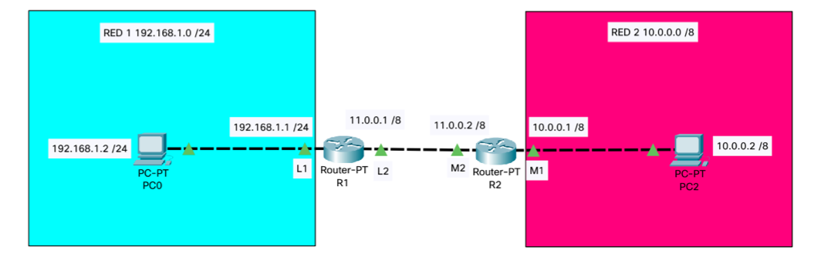

# EJERCICIO DE ENCAMINAMIENTO ESTÁTICO I

1. Realiza en Packet Tracer el diagrama de red tal y como el que se adjunta. Debes poner las direcciones ip que se indican así como los carteles.



2. Realiza un un ping entre el `PC0`y el `PC2`, pega el resultado en la caja de código:

```
C:\>ping 10.0.0.2

Pinging 10.0.0.2 with 32 bytes of data:

Request timed out.
Request timed out.
Request timed out.
Request timed out.

Ping statistics for 10.0.0.2:
    Packets: Sent = 4, Received = 0, Lost = 4 (100% loss),
``` 

3. Muestra las tablas `arp` de cada uno de los PC y de los routers:

+ PC0

```
C:\>arp -a
No ARP Entries Found
```

+ PC2

```
C:\>arp -a
No ARP Entries Found
```

+ Router R1

```
R1#show arp
Protocol  Address          Age (min)  Hardware Addr   Type   Interface
Internet  11.0.0.1                -   0010.115D.2263  ARPA   FastEthernet1/0
Internet  192.168.1.1             -   0002.16E4.E5A9  ARPA   FastEthernet0/0
```

+ Router R2

```
R2#show arp
Protocol  Address          Age (min)  Hardware Addr   Type   Interface
Internet  10.0.0.1                -   0060.2F46.EDE1  ARPA   FastEthernet0/0
Internet  11.0.0.2                -   0060.5C46.BD03  ARPA   FastEthernet1/0
```

4. Establece las rutas estáticas necesarias para que haya comunicación entre los dos equipos de las diferentes redes. Inserta una captura de ping desde cada máquina. Pega los comandos en las cajas de código y rellena las tablas adjuntas.

+ Router R1

```
R1(config)#ip route 10.0.0.0 255.0.0.0 11.0.0.2
```

***PEGAMOS LA TABLA DEL R1***
```
R1#show ip route
Codes: C - connected, S - static, I - IGRP, R - RIP, M - mobile, B - BGP
       D - EIGRP, EX - EIGRP external, O - OSPF, IA - OSPF inter area
       N1 - OSPF NSSA external type 1, N2 - OSPF NSSA external type 2
       E1 - OSPF external type 1, E2 - OSPF external type 2, E - EGP
       i - IS-IS, L1 - IS-IS level-1, L2 - IS-IS level-2, ia - IS-IS inter area
       * - candidate default, U - per-user static route, o - ODR
       P - periodic downloaded static route

Gateway of last resort is not set

S    10.0.0.0/8 [1/0] via 11.0.0.2
C    11.0.0.0/8 is directly connected, FastEthernet1/0
C    192.168.1.0/24 is directly connected, FastEthernet0/0
```


+ Router R2

```
R2(config)#ip route 192.168.1.0 255.255.255.0 11.0.0.1
```

***PEGAMOS LA TABLA DEL R2***
```
R2#show ip route
Codes: C - connected, S - static, I - IGRP, R - RIP, M - mobile, B - BGP
       D - EIGRP, EX - EIGRP external, O - OSPF, IA - OSPF inter area
       N1 - OSPF NSSA external type 1, N2 - OSPF NSSA external type 2
       E1 - OSPF external type 1, E2 - OSPF external type 2, E - EGP
       i - IS-IS, L1 - IS-IS level-1, L2 - IS-IS level-2, ia - IS-IS inter area
       * - candidate default, U - per-user static route, o - ODR
       P - periodic downloaded static route

Gateway of last resort is not set

C    10.0.0.0/8 is directly connected, FastEthernet0/0
C    11.0.0.0/8 is directly connected, FastEthernet1/0
S    192.168.1.0/24 [1/0] via 11.0.0.1
```

5. Realiza un un ping entre el `PC0`y el `PC2`, pega el resultado en la caja de código:

```
C:\>ping 10.0.0.2

Pinging 10.0.0.2 with 32 bytes of data:

Reply from 10.0.0.2: bytes=32 time<1ms TTL=126
Reply from 10.0.0.2: bytes=32 time<1ms TTL=126
Reply from 10.0.0.2: bytes=32 time=1ms TTL=126
Reply from 10.0.0.2: bytes=32 time<1ms TTL=126

Ping statistics for 10.0.0.2:
    Packets: Sent = 4, Received = 4, Lost = 0 (0% loss),
Approximate round trip times in milli-seconds:
    Minimum = 0ms, Maximum = 1ms, Average = 0ms
``` 


6. Muestra las tablas `arp` de cada uno de los PC y de los routers:

+ PC0

```
C:\>arp -a
  Internet Address      Physical Address      Type
  192.168.1.1           0002.16e4.e5a9        dynamic
```

+ PC2

```
C:\>arp -a
  Internet Address      Physical Address      Type
  10.0.0.1              0060.2f46.ede1        dynamic
```

+ Router R1

```
R1#show arp
Protocol  Address          Age (min)  Hardware Addr   Type   Interface
Internet  11.0.0.1                -   0010.115D.2263  ARPA   FastEthernet1/0
Internet  11.0.0.2                4   0060.5C46.BD03  ARPA   FastEthernet1/0
Internet  192.168.1.1             -   0002.16E4.E5A9  ARPA   FastEthernet0/0
Internet  192.168.1.2             4   000A.F3DE.7480  ARPA   FastEthernet0/0
```

+ Router R2

```
R2#show arp 
Protocol  Address          Age (min)  Hardware Addr   Type   Interface
Internet  10.0.0.1                -   0060.2F46.EDE1  ARPA   FastEthernet0/0
Internet  10.0.0.2                5   00E0.8F06.15E1  ARPA   FastEthernet0/0
Internet  11.0.0.1                5   0010.115D.2263  ARPA   FastEthernet1/0
Internet  11.0.0.2                -   0060.5C46.BD03  ARPA   FastEthernet1/0
```
