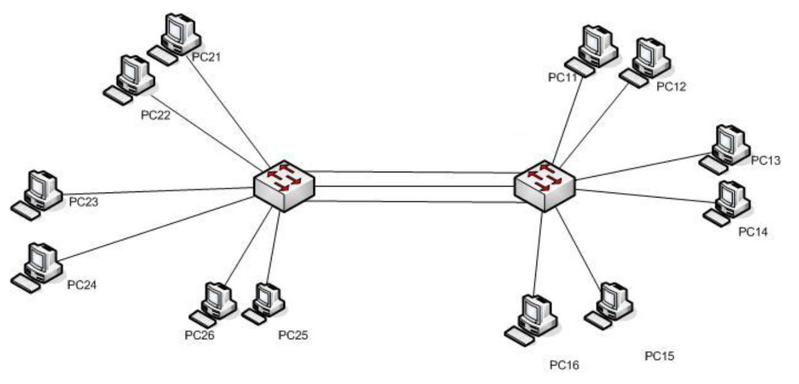
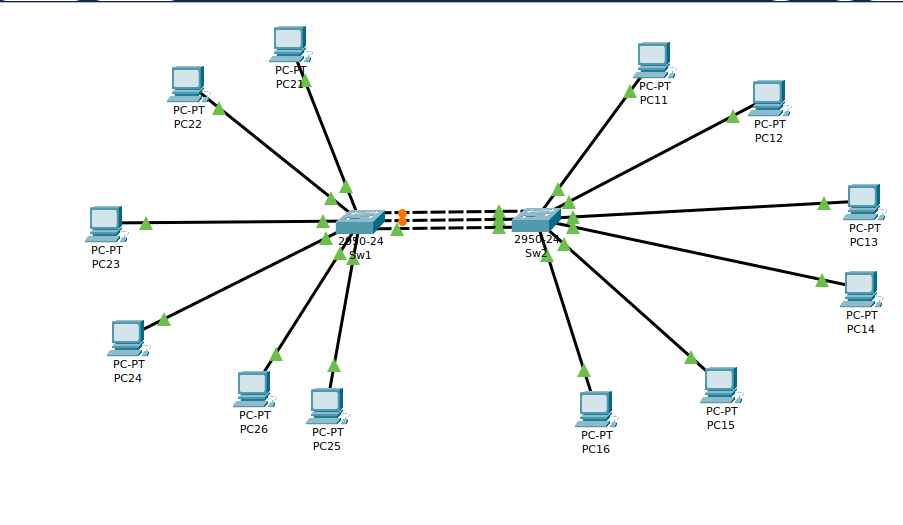

# CONFIGURACIÓN DE VLAN
Dado el esquema de red siguiente en el que los tres cables entre los dos switches pertenecen respectivamente a la `VLAN 10`, `VLAN 20` y `VLAN 30`:

Y con el direccionamiento `ip`  siguiente:

| HOST | DIRECCIÓN IP | VLAN | INTERFACE SW1 | INTERFACE SW2 |
| ---- | ------------ | ---- | ------------- | ------------- |
| PC11 | 10.0.0.11/24 | 10   |               | Fa0/2         |
| PC12 | 10.0.0.12/24 | 10   |               | Fa0/3         |
| PC13 | 10.0.0.13/24 | 20   |               | Fa0/4         |
| PC14 | 10.0.0.14/24 | 20   |               | Fa0/5         |
| PC15 | 10.0.0.15/24 | 30   |               | Fa0/6         |
| PC16 | 10.0.0.16/24 | 30   |               | Fa0/7         |
| PC21 | 10.0.0.21/24 | 10   | Fa0/2         |               |
| PC22 | 10.0.0.22/24 | 10   | Fa0/3         |               |
| PC23 | 10.0.0.23/24 | 20   | Fa0/4         |               |
| PC24 | 10.0.0.24/24 | 20   | Fa0/5         |               |
| PC25 | 10.0.0.25/24 | 30   | Fa0/6         |               |
| PC26 | 10.0.0.26/24 | 30   | Fa0/4         |               |

Los switches son del tipo ***Cisco 2950-24*** y están conectados entre sí de la siguiente forma:

| SW1    | SW2    | VLAN | NOMBRE DE LA VLAN |
| ------ | ------ | ---- | ----------------- |
| Fa0/24 | Fa0/24 | 10   | VENTAS            |
| Fa0/23 | Fa0/23 | 20   | TALLER            |
| Fa0/22 | Fa0/22 | 30   | MARKETING         | 

Responde a las siguientes preguntas:

1. Monta la topología en **Packet Tracer** y adjunta una imagen final

2. Configura en cada switch las `VLAN`:

 + SW1 
~~~
SW1(config)#vlan 10
SW1(config-vlan)#name ventas
SW1(config-vlan)#vlan 20
SW1(config-vlan)#name taller
SW1(config-vlan)#vlan 30
SW1(config-vlan)#name marketing
~~~

 + SW2
~~~
sw2(config)#no vlan 10
sw2(config)#vlan 10
sw2(config-vlan)#name ventas
sw2(config-vlan)#vlan 20
sw2(config-vlan)#name taller
sw2(config-vlan)#vlan 30
sw2(config-vlan)#name marketing
~~~

3. Configura cada uno de los puertos de los switches asignándolos a la `VLAN` que le corresponda, con la información que se da en las tablas del enunciado.

 + SW1 
~~~
SW1(config)#interface fastEthernet 0/2
SW1(config-if)#switchport access vlan 10
SW1(config-if)#exit
SW1(config)#interface fastEthernet 0/3
SW1(config-if)#switchport access vlan 10
SW1(config)#interface fastEthernet 0/4
SW1(config-if)#switchport access vlan 20
SW1(config-if)#exit
SW1(config)#interface fastEthernet 0/5
SW1(config-if)#switchport access vlan 20
SW1(config-if)#exit
SW1(config)#interface fastEthernet 0/6
SW1(config-if)#switchport access vlan 30
SW1(config-if)#exit
SW1(config)#interface fastEthernet 0/7
SW1(config-if)#switchport access vlan 30
SW1(config)#interface fastEthernet 0/24
SW1(config-if)#switchport access vlan 10
SW1(config-if)#exit
SW1(config)#interface fastEthernet 0/23
SW1(config-if)#switchport access vlan 20
SW1(config-if)#exit
SW1(config)#interface fastEthernet 0/22
SW1(config-if)#switchport access vlan 30
SW1(config-if)#exit
~~~
+  SW2
~~~
sw2(config)#interface fastEthernet 0/2
sw2(config-if)#swi
sw2(config-if)#switchport acc
sw2(config-if)#switchport access vlan 10
sw2(config-if)#exit
sw2(config)#interface fastEthernet 0/3
sw2(config-if)#switchport access vlan 10
sw2(config-if)#exit
sw2(config)#interface fastEthernet 0/4
sw2(config-if)#switchport access vlan 20
sw2(config-if)#exit
sw2(config)#interface fastEthernet 0/5
sw2(config-if)#switchport access vlan 20
sw2(config-if)#exit
sw2(config)#interface fastEthernet 0/6
sw2(config-if)#switchport access vlan 30
sw2(config-if)#exit
sw2(config)#interface fastEthernet 0/7
sw2(config-if)#switchport access vlan 30
sw2(config-if)#exit
sw2(config)#interface fastEthernet 0/24
sw2(config-if)#switchport access vlan 10
sw2(config-if)#exit
sw2(config)#interface fastEthernet 0/23
sw2(config-if)#switchport access vlan 20
sw2(config-if)#exit
sw2(config)#interface fastEthernet 0/22
sw2(config-if)#switchport access vlan 30
sw2(config-if)#exit
~~~

4. Muestra un resumen de las `VLAN` configuradas en cada switch:

+ SW1 
~~~
SW1#show vlan brief

VLAN Name                             Status    Ports
---- -------------------------------- --------- -------------------------------
1    default                          active    Fa0/1, Fa0/8, Fa0/9, Fa0/10
                                                Fa0/11, Fa0/12, Fa0/13, Fa0/14
                                                Fa0/15, Fa0/16, Fa0/17, Fa0/18
                                                Fa0/19, Fa0/20, Fa0/21
10   ventas                           active    Fa0/2, Fa0/3, Fa0/24
20   taller                           active    Fa0/4, Fa0/5, Fa0/23
30   marketing                        active    Fa0/6, Fa0/7, Fa0/22
1002 fddi-default                     active    
1003 token-ring-default               active    
1004 fddinet-default                  active    
1005 trnet-default                    active    
SW1#   
~~~
+  SW2
~~~
sw2#show vlan brief

VLAN Name                             Status    Ports
---- -------------------------------- --------- -------------------------------
1    default                          active    Fa0/1, Fa0/8, Fa0/9, Fa0/10
                                                Fa0/11, Fa0/12, Fa0/13, Fa0/14
                                                Fa0/15, Fa0/16, Fa0/17, Fa0/18
                                                Fa0/19, Fa0/20, Fa0/21
10   ventas                           active    Fa0/2, Fa0/3, Fa0/24
20   taller                           active    Fa0/4, Fa0/5, Fa0/23
30   marketing                        active    Fa0/6, Fa0/7, Fa0/22
1002 fddi-default                     active    
1003 token-ring-default               active    
1004 fddinet-default                  active    
1005 trnet-default                    active    
~~~

5. Comprueba, mediante `PING`, que hay comunicación entre los equipos que pertenecen a una misma `VLAN`

+ VLAN10
~~~
C:\>ping 10.0.0.21

Pinging 10.0.0.21 with 32 bytes of data:

Reply from 10.0.0.21: bytes=32 time<1ms TTL=128
Reply from 10.0.0.21: bytes=32 time<1ms TTL=128
Reply from 10.0.0.21: bytes=32 time<1ms TTL=128
Reply from 10.0.0.21: bytes=32 time<1ms TTL=128

Ping statistics for 10.0.0.21:
    Packets: Sent = 4, Received = 4, Lost = 0 (0% loss),
Approximate round trip times in milli-seconds:
    Minimum = 0ms, Maximum = 0ms, Average = 0ms
~~~
~~~
C:\>ping 10.0.0.23

Pinging 10.0.0.23 with 32 bytes of data:

Request timed out.
Request timed out.
Request timed out.

Ping statistics for 10.0.0.23:
    Packets: Sent = 3, Received = 0, Lost = 3 (100% loss),
~~~
+ VLAN20
~~~
C:\>ping 10.0.0.13

Pinging 10.0.0.13 with 32 bytes of data:

Reply from 10.0.0.13: bytes=32 time=5ms TTL=128
Reply from 10.0.0.13: bytes=32 time<1ms TTL=128
Reply from 10.0.0.13: bytes=32 time<1ms TTL=128
Reply from 10.0.0.13: bytes=32 time<1ms TTL=128

Ping statistics for 10.0.0.13:
    Packets: Sent = 4, Received = 4, Lost = 0 (0% loss),
Approximate round trip times in milli-seconds:
    Minimum = 0ms, Maximum = 5ms, Average = 1ms
~~~
~~~
C:\>ping 10.0.0.16

Pinging 10.0.0.16 with 32 bytes of data:

Request timed out.
Request timed out.
Request timed out.
Request timed out.

Ping statistics for 10.0.0.16:
    Packets: Sent = 4, Received = 0, Lost = 4 (100% loss),
~~~
+ VLAN30
~~~
C:\>ping 10.0.0.15

Pinging 10.0.0.15 with 32 bytes of data:

Reply from 10.0.0.15: bytes=32 time<1ms TTL=128
Reply from 10.0.0.15: bytes=32 time=5ms TTL=128
Reply from 10.0.0.15: bytes=32 time<1ms TTL=128
Reply from 10.0.0.15: bytes=32 time<1ms TTL=128

Ping statistics for 10.0.0.15:
    Packets: Sent = 4, Received = 4, Lost = 0 (0% loss),
Approximate round trip times in milli-seconds:
    Minimum = 0ms, Maximum = 5ms, Average = 1ms
~~~
~~~
C:\>ping 10.0.0.11

Pinging 10.0.0.11 with 32 bytes of data:

Request timed out.
Request timed out.
Request timed out.
Request timed out.

Ping statistics for 10.0.0.11:
    Packets: Sent = 4, Received = 0, Lost = 4 (100% loss),
~~~