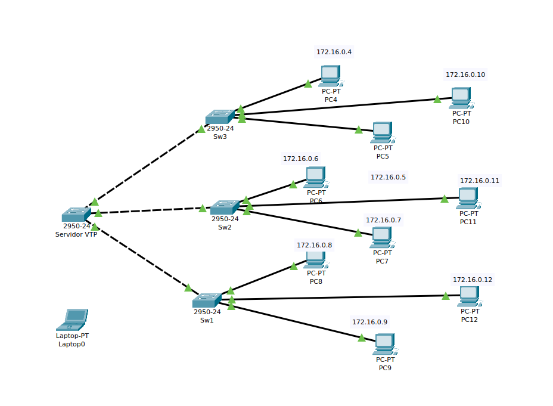

# CONFIGURACIÓN DE PARÁMETROS EN VLAN: VTP, VLAN DE ADMINISTRACIÓN Y SEGURIDAD DE PUERTOS

Dada la siguiente topología de red:

Y teniendo los requerimientos:

+ Direccionamiento `ip` de los equipos:

| HOST | IP          | VLAN |
| ---- | ----------- | ---- |
| PC4  | 172.16.0.4  | 10   |
| PC5  | 172.16.0.5  | 20   |
| PC6  | 172.16.0.6  | 10   |
| PC7  | 172.16.0.7  | 20   |
| PC8  | 172.16.0.8  | 10   |
| PC9  | 172.16.0.9  | 20   |
| PC10 | 172.16.0.10 | 30   |
| PC11 | 172.16.0.11 | 30   |
| PC12 | 172.16.0.12 | 30   | 

+ Los switches `SW1`, `SW2` y `SW3`  se conectan al principal `SW` por el ***puerto 24***.  Estos puertos serán ***troncales***.
+ El switch principal `SW` actuará como servidor `VTP`.  
+ Además de las `VLAN` que se ven en la figura se creará una `vlan 88` para los enlaces trunk que sera la ***vlan nativa***.  
+ Existirá una `vlan 99` de ***administración***.  
+ Cada switch tendrá una dirección `ip` para la administración en la red `192.168.0.0/24`  
+ El administrador de la red se conectará desde el ***puerto 20*** del `SW1` o desde el ***puerto 20*** del `SW2`. A esos puertos solo se podrá conectar el portátil del administrador. De lo contrario el  puerto se desactivará.  
+ En ninguno de los switches `SW1`, `SW2` y `SW3` se podrá conectar otro switch aparte del principal (servidor VTP).  
+ Los puertos que no estén en uso se desactivarán.  
+ Se activará una línea de `telnet` en cada switch para que el administrador pueda conectarse  en remoto. Contraseña 1234.

Resuelve las siguientes cuestiones:

1. Crea la topología usando ***Packet Tracer*** . Asigna las direciones `ip` a cada una de las máquinas. Inserta una imagen de la topología creada.

#### ***Configuración de VTP, VLAN y VLAN nativa***.

2. Configura el el dominio `VTP` con el nombre ***dominio_vtp*** y contraseña ***abcd***  en el switch principal `SW` . Crea las `VLAN` y configura los puertos que lo conectan con los otros switches en modo ***trunk*** con la `VLAN 88` como nativa. 

~~~
Switch>enable
Switch#conf term
Switch(config)#hostname SW
SW(config)#vtp mode server
Device mode already VTP SERVER.
SW(config)#vtp domain dominio_vtp
Changing VTP domain name from NULL to dominio_vtp
SW(config)#vtp password abcd
Setting device VLAN database password to abcd
SW(config)#vlan 10
SW(config-vlan)#name ventas
SW(config-vlan)#vlan 20
SW(config-vlan)#name desarrollo
SW(config-vlan)#vlan 30
SW(config-vlan)#name produccion
SW(config-vlan)#vlan 88
SW(config-vlan)#name troncales
SW(config-vlan)#vlan 99
SW(config-vlan)#name administracion

SW(config)#interface range fastEthernet 0/22-24
SW(config-if-range)#switchport mode trunk 
SW(config-if-range)#switchport access vlan 88
~~~

3. Muestra un resumen de las `VLAN` y los puertos ***trunk***  en el switch `SW`.
Resumen de las VLAN

~~~
SW#show vlan brief

VLAN Name                             Status    Ports
---- -------------------------------- --------- -------------------------------
1    default                          active    Fa0/1, Fa0/2, Fa0/3, Fa0/4
                                                Fa0/5, Fa0/6, Fa0/7, Fa0/8
                                                Fa0/9, Fa0/10, Fa0/11, Fa0/12
                                                Fa0/13, Fa0/14, Fa0/15, Fa0/16
                                                Fa0/17, Fa0/18, Fa0/19, Fa0/20
                                                Fa0/21
10   ventas                           active    
20   desarrollo                       active    
30   produccion                       active    
88   troncales                        active    
99   administracion                   active    
1002 fddi-default                     active    
1003 token-ring-default               active    
1004 fddinet-default                  active    
1005 trnet-default                    active   
~~~

Resumen de los puertos troncales
~~~
SW#show interfaces trunk
Port        Mode         Encapsulation  Status        Native vlan
Fa0/22      on           802.1q         trunking      88
Fa0/23      on           802.1q         trunking      88
Fa0/24      on           802.1q         trunking      88

Port        Vlans allowed on trunk
Fa0/22      1-1005
Fa0/23      1-1005
Fa0/24      1-1005

Port        Vlans allowed and active in management domain
Fa0/22      1,10,20,30,88,99
Fa0/23      1,10,20,30,88,99
Fa0/24      1,10,20,30,88,99

Port        Vlans in spanning tree forwarding state and not pruned
Fa0/22      1,10,20,30,88,99
Fa0/23      1,10,20,30,88,99
Fa0/24      10,20,30,99
~~~

4. Configura los switches `SW1`, `SW2` y `SW3` como ***clientes*** `VTP` . Configura en cada uno de ellos el puerto 24 como nativo para la `VLAN 88`.

~~~
SW1(config)#vtp mode client
Setting device to VTP CLIENT mode.
SW1(config)#vtp domain dominio_vtp
Domain name already set to dominio_vtp.
SW1(config)#vtp password abcd
Setting device VLAN database password to abcd
SW1(config)#interface fastEthernet 0/24
SW1(config-if)#switchport mode trunk 
SW1(config-if)#switchport trunk native vlan 88
~~~

~~~
SW2(config)#vtp mode client
Setting device to VTP CLIENT mode.
SW2(config)#vtp domain dominio_vtp
Domain name already set to dominio_vtp.
SW2(config)#vtp password abcd
Setting device VLAN database password to abcd
SW2(config)#interface fastEthernet 0/24
SW2(config-if)#switchport mode trunk
SW2(config-if)#switchport trunk native vlan 88
~~~

~~~
SW3(config)#vtp mode client
Setting device to VTP CLIENT mode.
SW3(config)#vtp domain dominio_vtp
Domain name already set to dominio_vtp.
SW3(config)#vtp password abcd
Setting device VLAN database password to abcd
SW3(config)#interface fastEthernet 0/24
SW3(config-if)#switchport mode trunk
SW3(config-if)#switchport trunk native vlan 88
~~~

5. Muestra un resumen las `VLAN` de `SW1`, `SW2` y `SW3` para comprobar que se han propagado las `VLAN` configuradas en el servidor.

+ SW1
~~~
SW1#show vlan brief

VLAN Name                             Status    Ports
---- -------------------------------- --------- -------------------------------
1    default                          active    Fa0/1, Fa0/2, Fa0/3, Fa0/4
                                                Fa0/5, Fa0/6, Fa0/7, Fa0/8
                                                Fa0/9, Fa0/10, Fa0/11, Fa0/12
                                                Fa0/13, Fa0/14, Fa0/15, Fa0/16
                                                Fa0/17, Fa0/18, Fa0/19, Fa0/20
                                                Fa0/21, Fa0/22, Fa0/23
10   ventas                           active    
20   desarrollo                       active    
30   produccion                       active    
88   troncales                        active    
99   administracion                   active    
1002 fddi-default                     active    
1003 token-ring-default               active    
1004 fddinet-default                  active    
1005 trnet-default                    active  
~~~
~~~
SW1#show interfaces trunk
Port        Mode         Encapsulation  Status        Native vlan
Fa0/24      on           802.1q         trunking      88

Port        Vlans allowed on trunk
Fa0/24      1-1005

Port        Vlans allowed and active in management domain
Fa0/24      1,10,20,30,88,99

Port        Vlans in spanning tree forwarding state and not pruned
Fa0/24      1,10,20,30,88,99
~~~

+ SW2

~~~
SW2#show vlan brief

VLAN Name                             Status    Ports
---- -------------------------------- --------- -------------------------------
1    default                          active    Fa0/1, Fa0/2, Fa0/3, Fa0/4
                                                Fa0/5, Fa0/6, Fa0/7, Fa0/8
                                                Fa0/9, Fa0/10, Fa0/11, Fa0/12
                                                Fa0/13, Fa0/14, Fa0/15, Fa0/16
                                                Fa0/17, Fa0/18, Fa0/19, Fa0/20
                                                Fa0/21, Fa0/22, Fa0/23
10   ventas                           active    
20   desarrollo                       active    
30   produccion                       active    
88   troncales                        active    
99   administracion                   active    
1002 fddi-default                     active    
1003 token-ring-default               active    
1004 fddinet-default                  active    
1005 trnet-default                    active
~~~
~~~
SW2#show interfaces trunk
Port        Mode         Encapsulation  Status        Native vlan
Fa0/24      on           802.1q         trunking      88

Port        Vlans allowed on trunk
Fa0/24      1-1005

Port        Vlans allowed and active in management domain
Fa0/24      1,10,20,30,88,99

Port        Vlans in spanning tree forwarding state and not pruned
Fa0/24      1,10,20,30,88,99
~~~

+ SW3

~~~
SW3#show vlan brief

VLAN Name                             Status    Ports
---- -------------------------------- --------- -------------------------------
1    default                          active    Fa0/1, Fa0/2, Fa0/3, Fa0/4
                                                Fa0/5, Fa0/6, Fa0/7, Fa0/8
                                                Fa0/9, Fa0/10, Fa0/11, Fa0/12
                                                Fa0/13, Fa0/14, Fa0/15, Fa0/16
                                                Fa0/17, Fa0/18, Fa0/19, Fa0/20
                                                Fa0/21, Fa0/22, Fa0/23
10   ventas                           active    
20   desarrollo                       active    
30   produccion                       active    
88   troncales                        active    
99   administracion                   active    
1002 fddi-default                     active    
1003 token-ring-default               active    
1004 fddinet-default                  active    
1005 trnet-default                    active 
~~~

~~~
SW3#show interfaces trunk
Port        Mode         Encapsulation  Status        Native vlan
Fa0/24      on           802.1q         trunking      88

Port        Vlans allowed on trunk
Fa0/24      1-1005

Port        Vlans allowed and active in management domain
Fa0/24      1,10,20,30,88,99

Port        Vlans in spanning tree forwarding state and not pruned
Fa0/24      1,10,20,30,88,99
~~~

#### ***Configuración de la VLAN de administración***.

7. Configura para cada switch la dirección `ip` para la administración en la red `192.168.0.0/24`, siguiendo el criterio:

| SWITCH | IP           | VLAN |
| ------ | ------------ | ---- |
| SW     | 192.168.0.10 | 99   |
| SW1    | 192.168.0.20 | 99   |
| SW2    | 192.168.0.30 | 99   |
| SW3    | 192.168.0.40 | 99   | 

+ SW

~~~
SW(config)#interface vlan 99
SW(config-if)#
%LINK-5-CHANGED: Interface Vlan99, changed state to up

%LINEPROTO-5-UPDOWN: Line protocol on Interface Vlan99, changed state to up

SW(config-if)#ip address 192.168.0.10 255.255.255.0
SW(config-if)#no shutdown 
~~~

+ SW1
~~~
SW1(config)#interface vlan 99
SW1(config-if)#
%LINK-5-CHANGED: Interface Vlan99, changed state to up

%LINEPROTO-5-UPDOWN: Line protocol on Interface Vlan99, changed state to up

SW1(config-if)#ip address 192.168.0.20 255.255.255.0
SW1(config-if)#no shutdown 
~~~

+ SW2

~~~
SW2(config)#interface vlan 99
SW2(config-if)#
%LINK-5-CHANGED: Interface Vlan99, changed state to up

%LINEPROTO-5-UPDOWN: Line protocol on Interface Vlan99, changed state to up

SW2(config-if)#ip address 192.168.0.30 255.255.255.0
SW2(config-if)#no shutdown 
~~~

+ SW3

~~~
SW3(config)#interface vlan 99
SW3(config-if)#
%LINK-5-CHANGED: Interface Vlan99, changed state to up

%LINEPROTO-5-UPDOWN: Line protocol on Interface Vlan99, changed state to up

SW3(config-if)#ip address 192.168.0.40 255.255.255.0
SW3(config-if)#no shutdown 
~~~

#### ***Configuración de la seguridad de puertos***.

6. Configura el ***puerto 20*** de `SW1` y  `SW2` de forma que sólo se podrán conectar a ellos  el portátil del administrador. De lo contrario el  puerto se desactivará. 

+ SW1
~~~
SW1(config)#interface fastEthernet 0/20
SW1(config-if)#switchport access vlan 99
SW1(config-if)#switchport mode access 
SW1(config-if)#switchport port-security 
SW1(config-if)#switchport port-security maximum 1
SW1(config-if)#switchport port-security mac-address 0001.97B2.0D90

~~~

+ Para que no se pueda conectar ningun otro switch a parte del servidor, aplicamos la restriccion de que cada puerto solo puede tener conectada una direccion 'mac'

~~~
SW1(config)#interface range fastEthernet 0/1-22
SW1(config-if-range)#switchport mode access 
SW1(config-if-range)#switchport port-security 
SW1(config-if-range)#switchport port-security maximum 1
SW1(config-if-range)#switchport port-security violation shutdown 
~~~

+ SW2

~~~
SW2(config)#interface fastEthernet 0/20
SW2(config-if)#switchport access vlan 99
SW2(config-if)#switchport mode access 
SW2(config-if)#switchport port-security 
SW2(config-if)#switchport port-security maximum 1

SW2(config-if)#switchport port-security mac-address 0001.97B2.0D90
Found duplicate mac-address 0001.97b2.0d90.
SW2(config-if)#interface range fastEthernet 0/1-22
SW2(config-if-range)#switchport mode access 
SW2(config-if-range)#switchport port-security 
SW2(config-if-range)#switchport port-security maximum 1
SW2(config-if-range)#switchport port-security violation shutdown 

~~~

7. Desactiva en cada uno de los switches los puertos que no estén en uso.

+ SW

~~~
SW(config)#interface range fastEthernet 0/1-21
SW(config-if-range)#shutdown 
~~~

+ SW1
~~~
SW1(config)#interface range fastEthernet 0/1-7,fa 0/10,fa 0/11
SW1(config-if-range)#shutdown 
SW1(config-if-range)#exit
SW1(config)#interface range fastEthernet 0/13-23
SW1(config-if-range)#shutdown 

~~~

+ SW2

~~~
SW2(config)#interface range fastEthernet 0/1-5,fa 0/8,fa 0/9,fa 0/10
SW2(config-if-range)#shutdown 
SW2(config-if-range)#exit
SW2(config)#interface range fastEthernet 0/12-23
SW2(config-if-range)#shutdown 
~~~

+ SW3

~~~
SW3(config)#interface range fastEthernet 0/1-3,fa 0/6-9
SW3(config-if-range)#shutd
SW3(config-if-range)#shutdown 

SW3(config)#interface range fastEthernet 0/11-23
SW3(config-if-range)#shut
SW3(config-if-range)#shutdown
~~~

8. Habilita una línea `telnet` en cada switch para que el administrador pueda conectarse  en remoto. La contraseña es ***1234***.

+ SW

~~~
SW(config)#line vty 0 4
SW(config-line)#password 1234
SW(config-line)#login
SW(config-line)#exit
~~~

+ SW1
~~~
SW1(config)#line vty 0 4
SW1(config-line)#password 1234
SW1(config-line)#login
SW1(config-line)#exit
~~~

+ SW2

~~~
SW2(config)#line vty 0 4
SW2(config-line)#password 1234
SW2(config-line)#login
SW2(config-line)#exit
~~~

+ SW3

~~~
SW3(config)#line vty 0 4
SW3(config-line)#password 1234
SW3(config-line)#login
SW3(config-line)#exit
~~~
