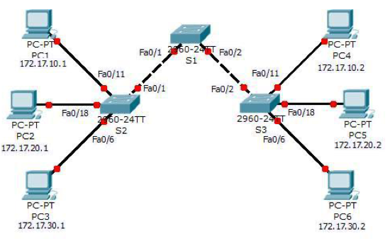

# RETO VTP

En esta práctica vamos a afrontar un reto `VTP`, debes seguir las instrucciones al pie de la letra. La topología de red para este reto es la siguiente:

La tabla de direccionamiento `IP` es la siguiente:

| DISPOSITIVO | INTERFAZ                 | DIRECCIÓN IP | MÁSCARA DE SUBRED |
| ----------- | ------------------------ | ------------ | ----------------- |
| S1          | VLAN99                   | 172.17.99.11 | 255.255.255.0     |
| S2          | VLAN99                   | 172.17.99.12 | 255.255.255.0     |
| S3          | VLAN99                   | 172.17.99.13 | 255.255.255.0     |
| PC1         | NIC                      | 172.17.10.1  | 255.255.255.0     |
| PC2         | NIV                      | 172.17.20.1  | 255.255.255.0     |
| PC3         | NIC                      | 172.17.30.1  | 255.255.255.0     |
| PC4         | NIC                      | 172.17.10.2  | 255.255.255.0     |
| PC5         | NIC                      | 172.17.20.2  | 255.255.255.0     |
| PC6         | NIC                      | 172.17.30.2  | 255.255.255.0     |

La tabla de asignaciones de puertos para los switches `S2` y `S3` es la siguiente:

| PUERTOS     | ASIGNACIONES             | RED            |
| ----------- | ------------------------ | -------------- |
| Fa0/1-0/5   | Enlaces troncales 802.1Q |                |
| Fa0/6-0/10  | VLAN 30 - Administración | 172.17.30.0/24 |
| Fa0/11-0/17 | VLAN 10 - Ingeniería     | 172.17.10.0/24 |
| Fa0/18-0/24 | VLAN 20 - Ventas         | 172.17.20.0/24 |
| Ninguno     | VLAN 99 - Mantenimiento  | 172.17.99.0/24 |

#### ***Configuraciones básicas de los switches.***

1. Configura el nombre de host de cada switch como se indica en la topología.

+ S1
~~~
Switch>enable
Switch#conf term
Switch(config)#hostname S1
S1(config)#
~~~

+ S2

~~~
Switch>enable
Switch#conf term
Switch(config)#hostname S2
S2(config)#
~~~

+ S3

~~~
Switch>enable
Switch#conf term
Switch(config)#hostname S3
S3(config)#
~~~

2. Deshabilita la búsqueda `DNS`.

 + S1
~~~
S1(config)#interface vlan 99
S1(config-if)#
%LINK-5-CHANGED: Interface Vlan99, changed state to up

S1(config-if)#ip addre
S1(config-if)#ip address 172.17.99.11 255.255.255.0
S1(config-if)#end
~~~

+ S2

~~~
PEGA EL CÓDIGO AQUÍ
~~~

+ S3

~~~
PEGA EL CÓDIGO AQUÍ
~~~

3. Configura la  contraseña encriptada ***class***  del modo `EXEC` privilegiado.

 + S1
~~~
PEGA EL CÓDIGO AQUÍ
~~~

+ S2

~~~
PEGA EL CÓDIGO AQUÍ
~~~

+ S3

~~~
PEGA EL CÓDIGO AQUÍ
~~~

4. Configura la contraseña ***cisco*** para las conexiones de la consola y VTY.

 + S1
~~~
PEGA EL CÓDIGO AQUÍ
~~~

+ S2

~~~
PEGA EL CÓDIGO AQUÍ
~~~

+ S3

~~~
PEGA EL CÓDIGO AQUÍ
~~~

#### ***Configuración de VTP en los switches.***

El `VTP` permite que el administrador de la red controle las instancias de las `VLAN` en la red mediante la creación de dominios de `VTP`. Dentro de cada dominio `VTP`, uno o más switches están configurados como ***servidores VTP***. Entonces, las `VLAN` se crean en el servidor VTP y se envían a los demás switches del dominio. Las tareas de configuración comunes del `VT`P son el modo operativo, el dominio y la contraseña. 

5. Configura el nombre de dominio del VTP como ***access*** y la contraseña del VTP como ***lab4*** en los tres switches.

 + S1
~~~
PEGA EL CÓDIGO AQUÍ
~~~

+ S2

~~~
PEGA EL CÓDIGO AQUÍ
~~~

+ S3

~~~
PEGA EL CÓDIGO AQUÍ
~~~

6. Configura `S1` en modo servidor del VTP,  `S2` como cliente y `S3` en modo transparente.

>NOTA-1: Packet Tracer califica inicialmente el modo para `S3` como incorrecto. Esto se corrige más adelante en la actividad.

>NOTA-2: El nombre de dominio del `VTP` se puede adquirir por medio de un switch cliente desde un switch servidor, pero sólo si el dominio del switch cliente se encuentra en estado nulo. No adquiere un nombre nuevo si se ha establecido uno previamente. Por tal motivo, es mejor configurar de forma manual el nombre de dominio en todos los switches para asegurar que se configure correctamente. Los switches en los diferentes dominios `VTP` no intercambian información de `VLAN`.

+ S1
~~~
PEGA EL CÓDIGO AQUÍ
~~~

+ S2

~~~
PEGA EL CÓDIGO AQUÍ
~~~

+ S3

~~~
PEGA EL CÓDIGO AQUÍ
~~~

7. Configura el enlace troncal y la ***VLAN nativa*** para las interfaces `FastEthernet 0/1-5` de los tres switches.

 + S1
~~~
PEGA EL CÓDIGO AQUÍ
~~~

+ S2

~~~
PEGA EL CÓDIGO AQUÍ
~~~

+ S3

~~~
PEGA EL CÓDIGO AQUÍ
~~~

8. Configura los puertos `Fa0/6`, `Fa0/11` y `Fa0/18` en `S2` y `S3` para permitir la conexión de un máximo de dos hosts a estos puertos y para que adquieran las direcciones `MAC` de los hosts de manera dinámica.

+ S2

~~~
PEGA EL CÓDIGO AQUÍ
~~~

+ S3

~~~
PEGA EL CÓDIGO AQUÍ
~~~

9. Configura en el servidor VTP las `VLAN`:

+ `VLAN 99` mantenimiento
+ `VLAN 10` ingeniería
+ `VLAN 20` ventas
+ `VLAN 30` administración

 + S1
~~~
PEGA EL CÓDIGO AQUÍ
~~~

10. Muestra un resumen de las `VLAN` en `S1`.

 + S1
~~~
PEGA EL CÓDIGO AQUÍ
~~~

11. Verifica si las `VLAN` que se crearon en S1 se propagaron a `S2` y  `S3`.

+ S2

~~~
PEGA EL CÓDIGO AQUÍ
~~~

+ S3

~~~
PEGA EL CÓDIGO AQUÍ
~~~

+ ¿Están las mismas `VLAN` configuradas en todos los switches?

~~~
ESCRIBE TU RESPUESTA AQUÍ
~~~

+ ¿Por qué `S2` y `S3` tienen diferentes configuraciones de `VLAN` en este punto?

~~~
ESCRIBE TU RESPUESTA AQUÍ
~~~

+ ¿Cómo podemos solucionarlo ?

~~~
PEGA EL CÓDIGO AQUÍ
~~~

+ Muestra que las `VLAN` se han propagado correctamente después de haberlo solucionado.

+ S2

~~~
PEGA EL CÓDIGO AQUÍ
~~~

+ S3

~~~
PEGA EL CÓDIGO AQUÍ
~~~

12. Configura los tres switches con las direcciones `IP` identificadas en la tabla de direccionamiento al comienzo de la práctica . Asigna estas direcciones a la `VLAN` de administración de la red (VLAN 99).

 + S1
~~~
PEGA EL CÓDIGO AQUÍ
~~~

+ S2

~~~
PEGA EL CÓDIGO AQUÍ
~~~

+ S3

~~~
PEGA EL CÓDIGO AQUÍ
~~~

13. Verifiqua que los switches estén configurados correctamente haciendo ping entre ellos. Desde S1, haga ping a la interfaz administrativa en S2 y S3. Desde S2, haga ping en la interfaz de administración de S3.

+ S1->S2

~~~
PEGA EL RESULTADO DEL PING AQUÍ
~~~

+ S1->S3

~~~
PEGA EL RESULTADO DEL PING AQUÍ
~~~

+ S2->S3

~~~
PEGA EL RESULTADO DEL PING AQUÍ
~~~

14. Asigna los  puertos de los  switch a las `VLAN`.

 + S1
~~~
PEGA EL CÓDIGO AQUÍ
~~~

+ S2

~~~
PEGA EL CÓDIGO AQUÍ
~~~

+ S3

~~~
PEGA EL CÓDIGO AQUÍ
~~~

15. Verifiqua que los enlaces troncales funcionen correctamente, para ello, desde el  `PC1`, intente hacer `ping` a  `PC4`, `PC5` y `PC6`.

+ PC1->PC4

~~~
PEGA EL RESULTADO DEL PING AQUÍ
~~~

+ PC1->PC5

~~~
PEGA EL RESULTADO DEL PING AQUÍ
~~~

+ PC1->PC6

~~~
PEGA EL RESULTADO DEL PING AQUÍ
~~~

+ ¿Tuvo éxito alguno de los pings?  

~~~
ESCRIBE TU RESPUESTA AQUÍ
~~~

+ ¿Por qué falló algún ping? 

~~~
ESCRIBE TU RESPUESTA AQUÍ
~~~

+ ¿Qué hosts se alcanzaron desde PC3?

~~~
ESCRIBE TU RESPUESTA AQUÍ
~~~
