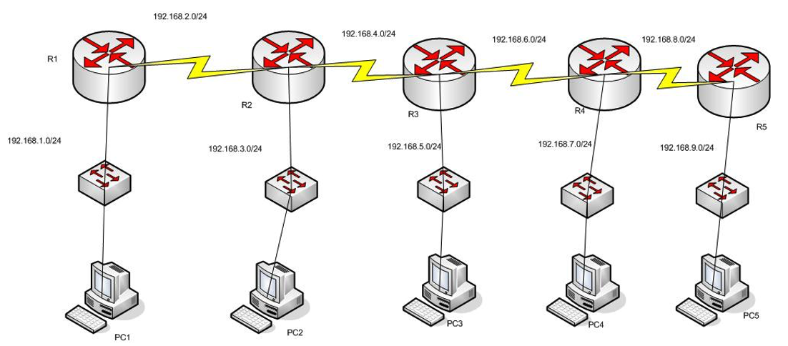
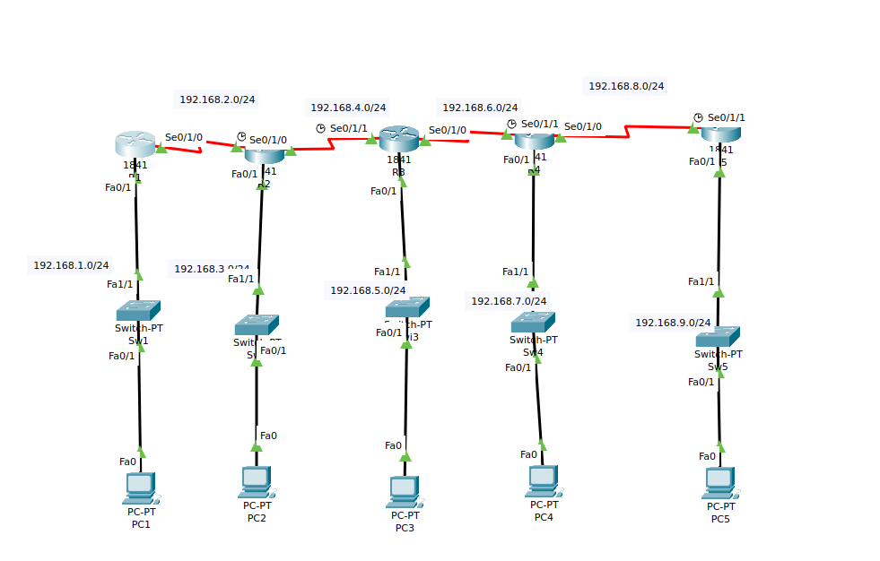

# ENRUTAMIENTO DINÁMICO RIP V1

Dada la siguiente topología de red:

1. Crear el siguiente esquema de red usando el ***Packet Tracert***. Configurar las interfaces de cada router y asignarle una dirección `IP` por cada interfaz.

2. Activar el protocolo `RIP` en cada uno de los routers de la figura de arriba.

+ R1

 ~~~
 R1(config)#router rip
R1(config-router)#
 ~~~

+ R2

 ~~~
R2(config)#router rip
R2(config-router)#
 ~~~
 
 + R3
 
 ~~~
R3(config)#router rip
R3(config-router)#
 ~~~
 
 + R4
 
 ~~~
R4(config)#router rip
R4(config-router)#
 ~~~
 
 + R5
 
 ~~~
R5(config)#router rip
R5(config-router)#

 ~~~

3. Publicar las redes con el protocolo `RIP` en cada una de los routers. 

+ R1

 ~~~
R1(config-router)#network 192.168.1.0
R1(config-router)#network 192.168.2.0
 ~~~

+ R2

 ~~~
R2(config-router)#network 192.168.2.0
R2(config-router)#network 192.168.3.0
R2(config-router)#network 192.168.4.0
 ~~~
 
+  R3

 ~~~
R3(config-router)#network 192.168.4.0
R3(config-router)#network 192.168.5.0
R3(config-router)#network 192.168.6.0
 ~~~
 
 + R4
 
 ~~~
R4(config-router)#network 192.168.6.0
R4(config-router)#network 192.168.7.0
R4(config-router)#network 192.168.8.0
 ~~~
 
 + R5
 
 ~~~
R5(config-router)#network 192.168.8.0
R5(config-router)#network 192.168.9.0
 ~~~

5. Muestra la tabla de enrutamiento del router **R3** para verificar si ha "aprendido" las redes de sus vecinos.

 + R3
 
 ~~~
 R3#show ip route 
Codes: C - connected, S - static, I - IGRP, R - RIP, M - mobile, B - BGP
       D - EIGRP, EX - EIGRP external, O - OSPF, IA - OSPF inter area
       N1 - OSPF NSSA external type 1, N2 - OSPF NSSA external type 2
       E1 - OSPF external type 1, E2 - OSPF external type 2, E - EGP
       i - IS-IS, L1 - IS-IS level-1, L2 - IS-IS level-2, ia - IS-IS inter area
       * - candidate default, U - per-user static route, o - ODR
       P - periodic downloaded static route

Gateway of last resort is not set

C    192.168.4.0/24 is directly connected, Serial0/1/1
C    192.168.5.0/24 is directly connected, FastEthernet0/1
C    192.168.6.0/24 is directly connected, Serial0/1/0
 ~~~

 + Comprobar si la distancia a las redes se corresponde con la métrica. Considerando que en `RIP` la métrica es el número de saltos. Por ejemplo la red `192.168.8.0/24` debe tener métrica 2.
 + ¿Cual es la distancia administrativa de las redes aprendidas por `RIP`?

 + R3
 
 ~~~
Metrica 1
 ~~~

6. Activar el modo de depuración en el router R2.

 + R2
 
 ~~~
R2#debug ip rip
RIP protocol debugging is on
R2#RIP: sending  v1 update to 255.255.255.255 via FastEthernet0/1 (192.168.3.1)
RIP: build update entries
      network 192.168.2.0 metric 1
      network 192.168.4.0 metric 1
RIP: sending  v1 update to 255.255.255.255 via Serial0/1/0 (192.168.4.1)
RIP: build update entries
      network 192.168.2.0 metric 1
      network 192.168.3.0 metric 1
 ~~~

+ ¿Cuáles son las rutas las rutas enviadas por R2 a R1?

~~~
network 192.168.3.0 
network 192.168.4.0
~~~

+ ¿Cuáles son las rutas las rutas recibidas en R2 por parte de R3?

~~~
network 192.168.2.0 
network 192.168.3.0
~~~

+ Razonar, analizando los apartados a y b, si funciona el horizonte dividido.

~~~
funciona porque tinen redundacia
~~~

7. Como se observa en el esquema de red, por la parte de la red Ethernet no hay ningún router, por tanto, se quiere evitar que el router no mande tráfico `RIP` por esa interfaz, ¿Qué se debe de hacer?

 + R1
 
 ~~~
 ~~~

+ R2

 ~~~
 ~~~
 
 + R3
 
 ~~~
 ~~~
 
 + R4
 
 ~~~
 ~~~
 
 + R5
 
 ~~~
 ~~~

8. Usando `show ip protocolos` en el router R2 y contestar a las siguientes preguntas:

+ ¿ Qué versión se está enviando?

~~~
Default version control: send version 1
~~~

+ ¿ Qué versión se acepta?

~~~
La version 1
~~~

+ ¿ Cada cuanto tiempo se envían las tablas de rutas ?

~~~
Cada 30 segundos
~~~

+ ¿ Qué redes están siendo publicadas por el `RIP` ?

~~~
Routing for Networks:
	192.168.2.0
	192.168.3.0
	192.168.4.0
~~~

+ ¿ Qué vecinos le están mandando información de enrutamiento?

~~~
  FastEthernet0/1       12 1
  Serial0/1/0           12 1
  Serial0/1/1           12 1
~~~

