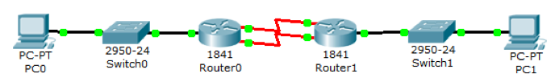
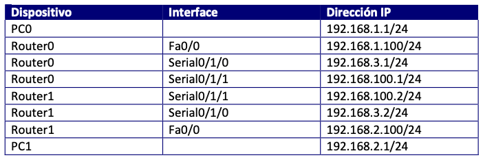
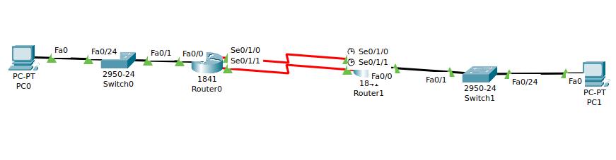
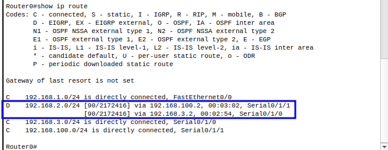
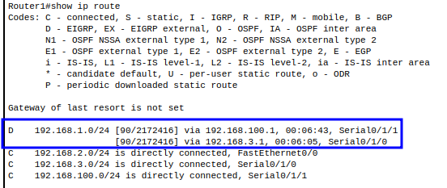
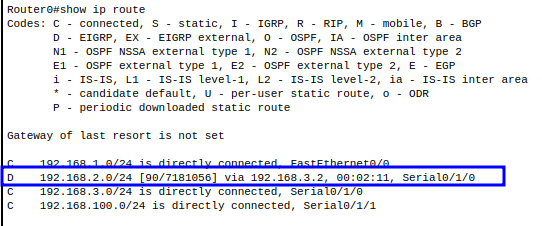
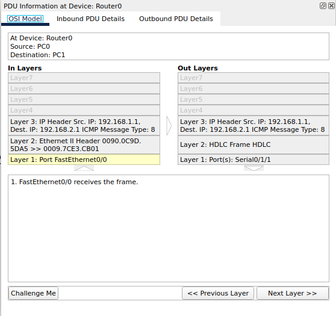

# ENRUTAMIENTO EIGRP  CON BALANCEO DE CARGA DE COSTOS DESIGUALES

Partiendo del siguiente esquema:

Y de la tabla de direccionamiento:

Vamos a conseguir realizar un balanceo de carga entre ambos enlaces cuando los costos de los enlaces son desiguales, ya que, cuando son iguales, el costo de los enlaces es el mismo, y la métrica definida también, por lo que, de forma automática, los routers se ponen a balancear carga por ambos enlaces.

1. Contruye la topología y asigna las direcciones  `IP` en base a la tabla.

2. Configura el protocolo **EIGRP** en los routers.

+ Router0

~~
Router0(config)#router eigrp 101
Router0(config-router)#network 192.168.1.0 
Router0(config-router)#network 192.168.3.0 
Router0(config-router)#network 192.168.100.0 
~~

+ Router1

~~
Router1(config)#router eigrp 101
Router1(config-router)#network 192.168.100.0
Router1(config-router)#
%DUAL-5-NBRCHANGE: IP-EIGRP 101: Neighbor 192.168.100.1 (Serial0/1/1) is up: new adjacency
Router1(config-router)#network 192.168.2.0
Router1(config-router)#network 192.168.3.0
Router1(config-router)#
%DUAL-5-NBRCHANGE: IP-EIGRP 101: Neighbor 192.168.3.1 (Serial0/1/0) is up: new adjacency
~~

+ Comprueba que hay conectividad entre las redes extremas:

+ PC0-> PC1

~~~
C:\>ping 192.168.2.1

Pinging 192.168.2.1 with 32 bytes of data:

Request timed out.
Reply from 192.168.2.1: bytes=32 time=1ms TTL=126
Reply from 192.168.2.1: bytes=32 time=2ms TTL=126
Reply from 192.168.2.1: bytes=32 time=7ms TTL=126

Ping statistics for 192.168.2.1:
    Packets: Sent = 4, Received = 3, Lost = 1 (25% loss),
Approximate round trip times in milli-seconds:
    Minimum = 1ms, Maximum = 7ms, Average = 3ms
~~~

+ PC1-> PC0

~~~
C:\>ping 192.168.1.1

Pinging 192.168.1.1 with 32 bytes of data:

Reply from 192.168.1.1: bytes=32 time=11ms TTL=126
Reply from 192.168.1.1: bytes=32 time=4ms TTL=126
Reply from 192.168.1.1: bytes=32 time=10ms TTL=126
Reply from 192.168.1.1: bytes=32 time=1ms TTL=126

Ping statistics for 192.168.1.1:
    Packets: Sent = 4, Received = 4, Lost = 0 (0% loss),
Approximate round trip times in milli-seconds:
    Minimum = 1ms, Maximum = 11ms, Average = 6ms
~~~

3. Muestra la tabla de enrutamiento. Señala la existencia dos caminos posibles que tienen la misma distancia administrativa y el mismo coste. Por este motivo, el sistema no escoge por dónde enviar la información, sino que balancea carga de forma automática.

+ Router0

+ Router1

4. Cambia el ancho de banda de alguno de los dos enlaces, esto nos dará un diferente costo. Al hacerlo se pierde la conexión por un instante.

+ Router0

~~~
Router0(config)#interface serial 0/1/0
Router0(config-if)#bandwidth 384
Router0(config-if)#
%DUAL-5-NBRCHANGE: IP-EIGRP 101: Neighbor 192.168.3.2 (Serial0/1/0) is down: interface down

%DUAL-5-NBRCHANGE: IP-EIGRP 101: Neighbor 192.168.3.2 (Serial0/1/0) is up: new adjacency
~~~

~~~
Router0(config)#interface serial 0/1/1
Router0(config-if)#bandwidth 64
Router0(config-if)#
%DUAL-5-NBRCHANGE: IP-EIGRP 101: Neighbor 192.168.100.2 (Serial0/1/1) is down: interface down

%DUAL-5-NBRCHANGE: IP-EIGRP 101: Neighbor 192.168.100.2 (Serial0/1/1) is up: new adjacency

~~~

5. Muestra la tabla de enrutamiento

+ Router0

Sólo aparece una de las dos conexiones. Lo solucionamos cambiando el parámetro de varianza, que es el parámetro que me permite utilizar valores de métrica que no sean exactamente iguales (la varianza mínima es 1 que es para que sean iguales, y la máxima varianza es 128), del grupo de EIGRP correspondiente:

~~~
Router0(config)#route eigrp 101
Router0(config-router)#var
Router0(config-router)#variance 10
Router0(config-router)#
%DUAL-5-NBRCHANGE: IP-EIGRP 101: Neighbor 192.168.3.2 (Serial0/1/0) is up: new adjacency

%DUAL-5-NBRCHANGE: IP-EIGRP 101: Neighbor 192.168.100.2 (Serial0/1/1) is up: new adjacency
~~~

No vamos a entrar en qué significa exactamente este parámetro. Sólo queremos ver
que funciona. Para ello, veamos ahora la tabla en enrutamiento:

comprobamos que el paquete viaja desde el pc0 al pc1 a travez de la interfaz `serial 0/1/1` 
debido a que se trata de una ruta mas optima

