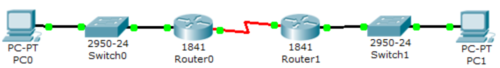
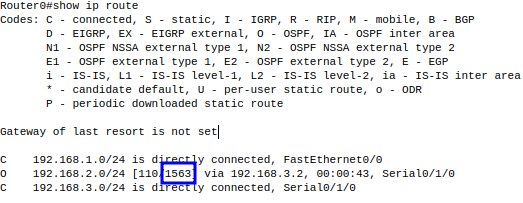
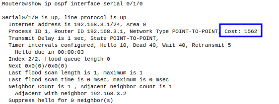

# ENRUTAMIENTO OSPF

Dado el esquema de red:

Y el direccionamiento `IP`:

| Dispositivo | Interface   | IP               |
|-------------|-------------|------------------|
| PC0         |             | 192.168.1.1/24   |
| Router0     | Fa0/0       | 192.168.1.100/24 |
| Router0     | Serial0/0/1 | 192.168.3.1/24   |
| Router1     | Serial0/0/1 | 192.168.3.2/24   |
| Router1     | Fa0/0       | 192.168.2.100/24 |
| PC1         |             | 192.168.2.1/24   |

1. Construye la topología dada y asigna el direccionamiento en base a la tabla
2. Configura en ambos routers el protocolo de enrutamiento dinámico **OSPF** :

+ Router0

~~~
Router0(config)#router ospf 1
Router0(config-router)#network 192.168.1.0 0.0.0.255 area 0
Router0(config-router)#network 192.168.3.0 0.0.0.255 area 0
~~~

+ Router1

~~~
Router1(config)#router ospf 1

Router1(config-router)#network 192.168.2.0 0.0.0.255 area 0
Router1(config-router)#network 192.168.3.0 0.0.0.255 area 0
~~~

3. Verifica la conectividad:

+ PC0->PC1

~~~
C:\>ping 192.168.2.1

Pinging 192.168.2.1 with 32 bytes of data:

Request timed out.
Reply from 192.168.2.1: bytes=32 time=1ms TTL=126
Reply from 192.168.2.1: bytes=32 time=1ms TTL=126
Reply from 192.168.2.1: bytes=32 time=1ms TTL=126

Ping statistics for 192.168.2.1:
    Packets: Sent = 4, Received = 3, Lost = 1 (25% loss),
Approximate round trip times in milli-seconds:
    Minimum = 1ms, Maximum = 1ms, Average = 1ms
~~~

+ PC1->PC0

~~~
C:\>ping 192.168.1.1

Pinging 192.168.1.1 with 32 bytes of data:

Reply from 192.168.1.1: bytes=32 time=17ms TTL=126
Reply from 192.168.1.1: bytes=32 time=1ms TTL=126
Reply from 192.168.1.1: bytes=32 time=1ms TTL=126
Reply from 192.168.1.1: bytes=32 time=1ms TTL=126

Ping statistics for 192.168.1.1:
    Packets: Sent = 4, Received = 4, Lost = 0 (0% loss),
Approximate round trip times in milli-seconds:
    Minimum = 1ms, Maximum = 17ms, Average = 5ms
~~~

4. Muestra la tabla de enrutamiento

+ Router0

~~~
Router0#show ip route
Codes: C - connected, S - static, I - IGRP, R - RIP, M - mobile, B - BGP
       D - EIGRP, EX - EIGRP external, O - OSPF, IA - OSPF inter area
       N1 - OSPF NSSA external type 1, N2 - OSPF NSSA external type 2
       E1 - OSPF external type 1, E2 - OSPF external type 2, E - EGP
       i - IS-IS, L1 - IS-IS level-1, L2 - IS-IS level-2, ia - IS-IS inter area
       * - candidate default, U - per-user static route, o - ODR
       P - periodic downloaded static route

Gateway of last resort is not set

C    192.168.1.0/24 is directly connected, FastEthernet0/0
O    192.168.2.0/24 [110/65] via 192.168.3.2, 00:01:53, Serial0/1/0
C    192.168.3.0/24 is directly connected, Serial0/1/0
~~~

+ Router1

~~~
Router1#show ip route
Codes: C - connected, S - static, I - IGRP, R - RIP, M - mobile, B - BGP
       D - EIGRP, EX - EIGRP external, O - OSPF, IA - OSPF inter area
       N1 - OSPF NSSA external type 1, N2 - OSPF NSSA external type 2
       E1 - OSPF external type 1, E2 - OSPF external type 2, E - EGP
       i - IS-IS, L1 - IS-IS level-1, L2 - IS-IS level-2, ia - IS-IS inter area
       * - candidate default, U - per-user static route, o - ODR
       P - periodic downloaded static route

Gateway of last resort is not set

O    192.168.1.0/24 [110/65] via 192.168.3.1, 00:02:14, Serial0/1/0
C    192.168.2.0/24 is directly connected, FastEthernet0/0
C    192.168.3.0/24 is directly connected, Serial0/1/0
~~~

5. Muestra la información del protocolo de enrutamiento

+ Router0

~~~
Router0#show ip protocols 

Routing Protocol is "ospf 1"
  Outgoing update filter list for all interfaces is not set 
  Incoming update filter list for all interfaces is not set 
  Router ID 192.168.3.1
  Number of areas in this router is 1. 1 normal 0 stub 0 nssa
  Maximum path: 4
  Routing for Networks:
    192.168.1.0 0.0.0.255 area 0
    192.168.3.0 0.0.0.255 area 0
  Routing Information Sources:  
    Gateway         Distance      Last Update 
    192.168.3.1          110      00:04:30
    192.168.3.2          110      00:04:30
  Distance: (default is 110)
~~~

+ Router1

~~~
Router1#show ip protocols 

Routing Protocol is "ospf 1"
  Outgoing update filter list for all interfaces is not set 
  Incoming update filter list for all interfaces is not set 
  Router ID 192.168.3.2
  Number of areas in this router is 1. 1 normal 0 stub 0 nssa
  Maximum path: 4
  Routing for Networks:
    192.168.2.0 0.0.0.255 area 0
    192.168.3.0 0.0.0.255 area 0
  Routing Information Sources:  
    Gateway         Distance      Last Update 
    192.168.3.1          110      00:04:46
    192.168.3.2          110      00:04:46
  Distance: (default is 110)
~~~

6. Cambiemos el valor del costo del enlace **OSPF** en el Router0 (era de 65 y lo pasamos a 1562)

+ Router0

~~~
Router0(config)#interface serial 0/1/0
Router0(config-if)#ip ospf cost 1562
~~~

+ Verificamos que se produce el cambio

Otra forma de mostrar el cambio es:

7. Activar la autenticación entre enlaces **OSPF** para evitar la intrusión dentro del sistema de routers. Primero lo realizamos en el Router0 y comprobamos si hay comunicación.

+ Router0

~~~
Router0(config)#router ospf 1
Router0(config-router)#area 0 authentication message-digest 
Router0(config-router)#exit

Router0(config)#interface serial 0/1/0
Router0(config-if)#
00:36:50: %OSPF-5-ADJCHG: Process 1, Nbr 192.168.3.2 on Serial0/1/0 from FULL to DOWN, Neighbor Down: Dead timer expired

00:36:50: %OSPF-5-ADJCHG: Process 1, Nbr 192.168.3.2 on Serial0/1/0 from FULL to DOWN, Neighbor Down: Interface down or detached

Router0(config-if)#ip ospf message-digest-key 1 md5 contrasenia
~~~

+ Comprobación de conectividad entre  PC0->PC1

~~~
C:\>ping 192.168.2.1

Pinging 192.168.2.1 with 32 bytes of data:

Reply from 192.168.1.100: Destination host unreachable.
Reply from 192.168.1.100: Destination host unreachable.
Reply from 192.168.1.100: Destination host unreachable.
Reply from 192.168.1.100: Destination host unreachable.

Ping statistics for 192.168.2.1:
    Packets: Sent = 4, Received = 0, Lost = 4 (100% loss),
~~~

+ ¿ Qué mensajes aparecen en el Router1 ?

~~~
%LINK-5-CHANGED: Interface Serial0/1/0, changed state to up

%LINEPROTO-5-UPDOWN: Line protocol on Interface FastEthernet0/0, changed state to up

%LINEPROTO-5-UPDOWN: Line protocol on Interface Serial0/1/0, changed state to up

00:00:10: %OSPF-5-ADJCHG: Process 1, Nbr 192.168.3.1 on Serial0/1/0 from LOADING to FULL, Loading Done

00:36:50: %OSPF-5-ADJCHG: Process 1, Nbr 192.168.3.1 on Serial0/1/0 from FULL to DOWN, Neighbor Down: Dead timer expired

00:36:50: %OSPF-5-ADJCHG: Process 1, Nbr 192.168.3.1 on Serial0/1/0 from FULL to DOWN, Neighbor Down: Interface down or detached
~~~

8. Activar la autenticación entre enlaces **OSPF** en el Router1

+ Router1

~~~
Router1(config)#router ospf 1
Router1(config-router)#area 0 authentication message-digest 
Router1(config-router)#exit
Router1(config)#interface serial 0/1/0
Router1(config-if)#ip ospf message-digest-key 1 md5 contrasenia
~~~

+ Comprobación de conectividad entre  PC0->PC1

~~~
C:\>ping 192.168.2.1

Pinging 192.168.2.1 with 32 bytes of data:

Request timed out.
Reply from 192.168.2.1: bytes=32 time=1ms TTL=126
Reply from 192.168.2.1: bytes=32 time=1ms TTL=126
Reply from 192.168.2.1: bytes=32 time=1ms TTL=126

Ping statistics for 192.168.2.1:
    Packets: Sent = 4, Received = 3, Lost = 1 (25% loss),
Approximate round trip times in milli-seconds:
    Minimum = 1ms, Maximum = 1ms, Average = 1ms
~~~

9. En **OSPF**, si queremos propagar alguna ruta por omisión (de las de ruteo estático), utilizaremos el comando `default-information originate`

